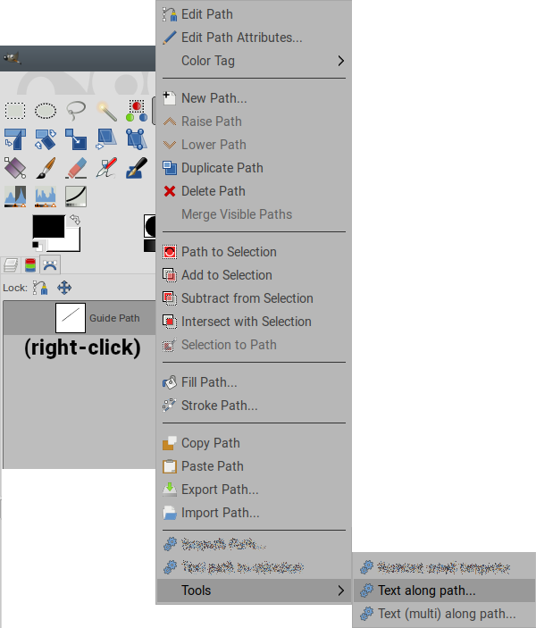
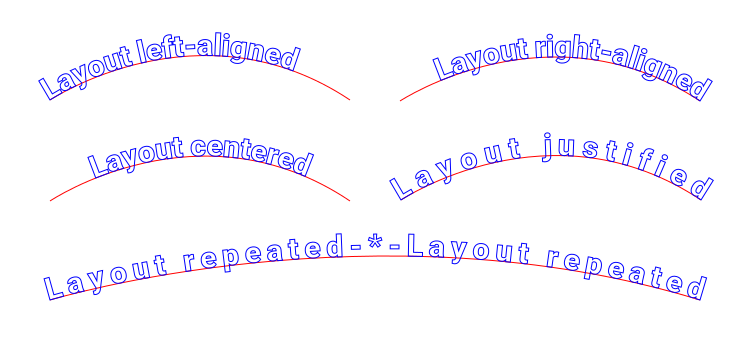
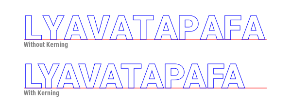
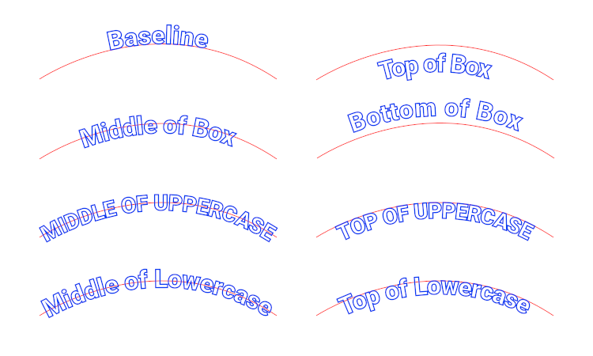
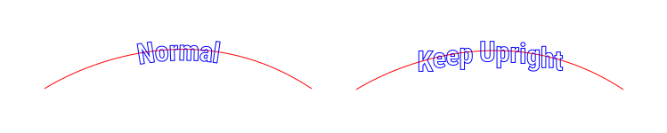
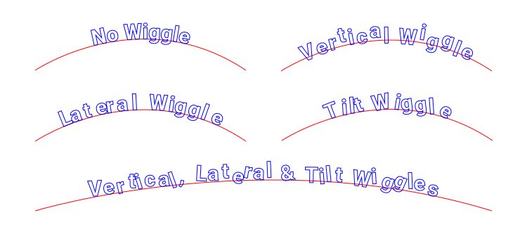
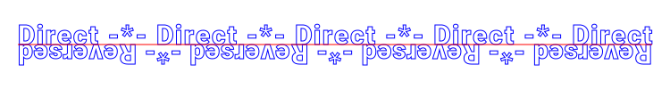
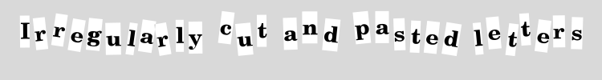
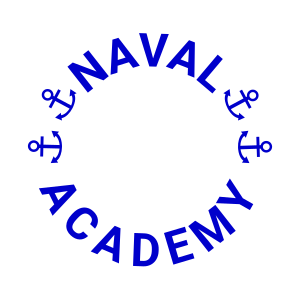

[English](./ofn-text-along-path-en.html) {style="text-align:right"}

:::{.table-of-contents}
""목차""
- ...
  - [머리말]
- [ofn-text-along-path]
  - [선택 사항]
    - [Text(글)]
    - [Spacer(사이 띄움 문자열)]
    - [Font name(글꼴 이름)]
    - [Font size(글꼴 크기)]
    - [Layout(배치)]
    - [Use kerning(커닝 사용)]
    - [Extra spacing(여분의 간격 두기)]
    - [Height reference(높이 기준)]
    - [Vertical adjust(수직 조정)]
    - [Keep upright(똑바로 있게 하기)]
    - [Lateral wiggle(옆쪽 꿈틀)]
    - [Vertical wiggle(수직 꿈틀)]
    - [Tilt wiggle(기울이기 꿈틀)]
    - [Reverse stroke direction(부경로 방향 뒤집기)]
    - [상자를 경로로 생성 및 표시]
  - [사용법 노트]
    - [문자들]
    - [경로]
    - [Stroke origin and direction(부경로 원점과 방향)]
    - [다른 원 둘레에 텍스트 놓기]

:::

## 머리말

이 스크립트는 “경로”에 관한 것이므로, 이 문서에서는 경로 개념과 용어를 많이 사용합니다.

GIMP의 경로에 대한 기본적인 정보는 다음 링크를 참조하세요.
::[여기(영문)](https://www.gimp-forum.net/Thread-Paths-Basics)::{.link-with-icon}
및 ::[저기(영문)](https://docs.gimp.org/en/gimp-using-paths.html)::{.link-with-icon}.

ofn-text-along-path
===================

경로 목록 창의 한 경로 위에서 우클릭하여  다음 두 메뉴 중 하나 선택.

- Ofnuts/Tools/Text (multi) along path
- Ofnuts/Tools/Text along path

이 플러그인의 대화창에서 선택한 글꼴 및 글꼴 크기로 텍스트 경로를 만든 다음, 
생성된 텍스트 경로의 각 문자를 현재 경로를 따라 배치. 이때, 다른 옵션에 맞추어 각 문자의 회전 및 
이동하는 방식이 달라집니다.

이 도구는 김프 텍스트 도구의 `경로 따라 텍스트`를 개선한 버전입니다.

- 문자 형태를 왜곡하지 않습니다. 각 문자를 회전 및 이동합니다.
- 경로 상에서 텍스트를 왼쪽,오른쪽,중간,양쪽 맞춤 또는 반복 가능.
- 유도선 경로 기준으로 수직 위치 지정 가능

두 개의 서로 다른 기능함수가 있음:

- 한 줄로 된 텍스트가 경로의 모든 부경로마다 사용되는 기능함수. 표준 모드.
- 경로의 각 부경로에 텍스트의 한 줄씩 사용되는 기능함수. multi(다중) 모드

**경로 목록 창**에서 유도선 경로로 사용될 경로에서 우클릭해서 호출. `도구` 하위 메뉴에 있음. 

## 선택 사항

### Text(글)

글

- 표준 모드: 한 줄 텍스트. 텍스트 경로의 너비가, 유도선 경로의 최단 부경로의 폭보다 넓어지면 안 됨.
- 다중 모드: 경로로 변환된, 텍스트의 각 줄의 너비가, 대응하는 부경로보다 짧아야 함. 
텍스트의 줄 수와 유도선 경로 안의 부경로의 개수가 똑같아야 함.

### Spacer(사이 띄움 문자열)

 `반복됨` 레이아웃을 사용할 때, 반복되는 텍스트의 사이에 넣을 문자열. 
열린 부경로에서 텍스트의 사본 '사이'에만 넣어짐.
닫힌 경로에서, 각 텍스트의 끝에 더해짐.

### Font name(글꼴 이름)

비워 두면, 현재 글꼴(텍스트 도구에서 선택한 글꼴)을 사용.

### Font size(글꼴 크기)

픽셀 단위의 크기

### Layout(배치)

- `왼쪽 맞춤`: 텍스트의 원래 너비는 변경하지 않고, 부경로의 시작부분에 왼쪽을 맞춤.
- `오른쪽 맞춤`:  텍스트 경로의 원래 너비는 변경하지 않고, 부경로의 끝부분에 
  오른쪽을 맞춤
- `중심 맞춤`:  텍스트의 원래 너비는 변경하지 않고, 부경로의 중간부분에 가운데를 맞춤
- `양쪽 맞춤`: 텍스트가 유도선 안 부경로의 전체 길이를 채우도록 문자 사이에 여분의 
  공간을 삽입.
- `반복됨`: 부경로를 채우도록 텍스트를 반복한 후, 모자라면 너비를 늘임. 
  `스페이서` 텍스트가 있으면 각 텍스트 사이에 놓음.

### Use kerning(커닝 사용)

[커닝](https://en.wikipedia.org/wiki/Kerning)을 
사용하여 더 규칙적으로 글자 사이를 띄우려고 시도.
커닝은 간접적으로 얻으며 모든 글꼴에서 잘 작동하지는 않음. 특히, 이탤릭 글꼴에서는 커닝 입력란은 
비워두는 것이 최선임.

### Extra spacing(여분의 간격 두기)

모든 글자 사이에 여분의 공간을 삽입해서 텍스트를 넓힘. 1 픽셀이 안 되는 값(소수점이 있는 수) 사용 
가능. 
경로의 부경로에 타이트한 곡선이 있거나, `tilt wiggle` 옵션을 사용할 때, 문자 사이에 약간 더 여유 
공간을 주어서 문자가 겹치지 않게 할 때 유용함. 
`양쪽 맞춤` 레이아웃에서는 이 값을 무시. `반복됨` 레이아웃에서는 최소값으로 사용(실제
 문자 간격은 넓어질 수 있음).

### Height reference(높이 기준)

유도선 기준의 수직 위치. `box(상자)`는 텍스트 도구였으면 텍스트 레이어의 바운더리였을 부분.

`대문자 상단`, `대문자 중간`,
`소문자 상단`, `소문자 중간`의 실제 높이는 
`X`의 대문자, 소문자를 그려 낸 것을 검사해서 계산됨. "예술적" 글꼴에는 잘 맞지 않음.

### Vertical adjust(수직 조정)

높이 조정. `높이 기준` 옵션에 더해짐. 1픽셀이 안 되는 값도 허용됨.

### Keep upright(똑바로 있게 하기)

'예'이면, 글자를 기울이지 않음.

### Lateral wiggle(옆쪽 꿈틀)

무작위로 좌우로 위치를 바꿀 최댓값. 평균 문자 너비에 대한 퍼센트로 표시.

### Vertical wiggle(수직 꿈틀)

무작위로 상하로 위치를 바꿀 최댓값. `문자 상자`의 높이에 대한 퍼센트로 표시.

### Tilt wiggle(기울이기 꿈틀)

각 문자를 무작위로 더 기울일 최댓값. 각도 단위로 표시.

### Reverse stroke direction(부경로 방향 뒤집기)

"예"로 하면 부경로의 방향과 반대로 문자를 배치함. 또한 문자가 부경로의 반대 편에 문자가 놓이게 됨.

### 상자를 경로로 생성 및 표시

`상자를 경로로 표시`는 최초에는 디버깅용이었음. 문자 상자에 사각형 경로를 생성해서, 
문자 경로의 위치가 정해진 방법과 이유를 더 확실하게 보여줌. 예술적 용도로 사용하도록 남겨 놓았음.
실제 출력은 `생성하기` 선택에 따라 달라짐.

`생성하기`가 주 옵션임:

- `단일 경로 하나`:  경로 하나를 만들어서 모든 문자 출력을 담음. '상자'가 
  요청되면, 그 문자들에 대해 추가 경로가 하나가 만들어짐.
- `부경로마다 경로 하나`: 유도선 경로 안에서, 문자들이 배치된 부경로마다 경로 
  하나가 만들어짐. 움직그림에 특히 유용.
  '상자'가 요청되면, 각 부경로마다 추가로 경로 하나가 만들어짐.
- `텍스트와 스페이서 경로를 분리`: 경로 두 개 생성. 하나는 
  `텍스트` 입력란의 모든
  문자용이고, 다른 하나는 `스페이서` 입력란의 모든 문자용임. 이 두 문자 부류의 
  처리(색 등등)를 나중에 다르게 할 때 유용.
  '상자'가 요청되면, 경로 두 개가 더 생성됨. 하나는 텍스트 상자용이고 하나는 스페이서용임
- `문자당 경로 하나`: 문자마다 경로 하나 생성. '상자'가 요청되면, 같은 
  경로에 상자가 추가됨. 즉, 각 경로가
  문자와 그 문자의 상자를 담음.

## 사용법 노트

### 문자들

대화창에 입력할 수 있고 글꼴 안에 있는 문자는 모두 사용 가능.
이것은 이모지 등등 가능한 유니코드 심볼 전체를 사용할 수 있음을 의미함.
일반 키보드로 입력할 수 없는 문자는 문자표(또는 웹 페이지)에서 복사해서 붙여 넣을 수 있음.

### 경로

이 플러그인은 경로 안의 모든 부경로를 사용함. 각 부경로는 독립된 단위로 간주함.
이 플러그인이 제대로 작동하지 않으면, 간과된 부경로를 찾아 볼 것(특히, 단일-포인트 부경로들[^1]).

[^1]: (역주: 경로 목록 창에서 우클릭하고 '경로 편집'하면 앵커 하나뿐인 부경로가 있을 때, 편집할 수 있음.)

### Stroke origin and direction(부경로 원점과 방향)

텍스트는 부경로의 시작점부터 끝점까지 사용하여 배치됩니다.
대부분의 겨우, 열린 부경로는 왼쪽에서 오른쪽으로 진행하고, 닫힌 경로는 시계방향으로 진행합니다.
부경로가 하나뿐인 경로는, `뒤집기` 옵션으로 진행 방향을 바꿀 수 있습니다.
부경로가 여러 개이면, 이 옵션은 부경로가 모두 잘못된 방향일 때만 유용합니다.

원처럼 닫힌 부경로의 원점은 결정하기 어려움.
::
[이 짧은 write-up(보충 논평)](https://www.gimp-forum.net/Thread-Paths-Basics)::{.link-with-icon}이
닫힌 경로의 부경로 원점을 변경하는 기교에 대해 상세 설명합니다.[^2]

[^2]: (역주: 보충 논평 중에서 이 페이지와 관련된 요점은, 닫힌 부경로의 선분 하나를 
Ctrl+Space+클릭으로 지웠다가 끝노드를 클릭, 다른 끝 노드를 Ctrl+클릭 해서 다시 이으면 그 위치가 첫 
앵커와 마지막 앵커로 바뀐다는 것)

### 다른 원 둘레에 텍스트 놓기

텍스트 하나는 위에 하나는 아래에 놓기.
텍스트가 상단 및 하단에서 가운데 맞춤이 되도록 하는 두 가지 방법:

- 완전한 원 유지하기:

  - 6시 눈금에서 원이 시작하는지 확인.[^3]
  - 경로 위에서 우클릭하고 ::도구 &rarr; 경로 따라 텍스트::{.menupath}를 실행하여 상단 텍스트를
    배치(`가운데 맞춤` 배치를 사용)
  - 원형 경로를 복제, 뒤집기 도구로 수직으로 뒤집기(도구 옵션에서 `경로 뒤집기` 옵션을 선택한 
    상태여야 함)
  - 같은 방법으로 하단 텍스트를 배치. 원을 뒤집으면 방향도 뒤집히므로 `경로 방향 뒤집기` 옵션
    사용 불필요.

[^3]: (역주: 왼쪽 눈금자에서부터 끌어서 수직 안내선 생성, 경로 도구 선택, 원의 반지름과 원주의 
6시 눈금이 될 곳을 안내선에 맞추어 클릭해서 경로 생성, 생성된 도구를 우클릭하고 ::도형/선분
상에 &rarr; 원::{.menupath}에서 `반지름`와 `연속적`을 선택하고 확인을 누르면 정확히 6시 눈금에서 
시작.)

- 원을 반쪽으로 나누기:
   ::(이 방법을 사용하려면 상단과 하단 텍스트가 각각 반원보다 짧아야 함)::{style="font-size:smaller"}

  - 수평 지름 상에 앵커가 없으면 추가.
  - 원을 복제
  - 하나는 아래 반을 도려 내고, 다른 하나는 위의 반쪽을 도려 냄[^4]
  - 상단 반원 경로를 선택하고 ::도구 &rarr; 경로 따라 텍스트::{.menupath}로 상단 텍스트를 배치.
    이때 `가운데 맞춤` 배치 사용.
  - 하단 반원 경로로 선택하고 마찬가지로 하단 텍스트 배치. 이때 보통은
    `경로 방향 뒤집기` 옵션을 사용해야 함.

[^4]: (역주: 경로 도구로, 도려낼 부분에서 지름과 가까운 선분 두 개를 Ctrl+Shift+클릭해서 제거. 
선택 도구로 도려낼 부경로의 일부를 선택. 경로를 우클릭. ::편집 &rarr; 부경로 삭제::{.menupath}

뒤집힌 경로를 사용한 예. 유니코드 "Anchor(닻)" 기호(&#x2693;) (`U+2693`)와  "Roboto Bold" 글꼴 
사용:

텍스트의 위쪽과 아래쪽 레이아웃이 동일하도록 하려면 두 텍스트 부분 모두에 `대문자/소문자 중간`을 
사용하거나, 한쪽에는 `대문자/소문자 상단`을, 다른 쪽에는 `기준선`을 사용하십시오.

### 경로 생성

간단하게 설명하기 위해 경로 생성 옵션은 유용한 경우로 제한했습니다.
하지만 스크립트를 여러 번 실행하여 생성 옵션을 조합하고 불필요한 출력은 제거할 수 있습니다.

### 기타 유용한 스크립트

다음과 같은 여러 기능을 제공하는 제
::
[ofn-path-edits scripts](https://sourceforge.net/projects/gimp-path-tools/files/scripts/)::{.link-with-icon}
를 참조하세요.

- 경로의 스트로크 확인: 개수, 순서, 시작/끝점
- 스트로크 반전
- 경로에서 스트로크 추출
- 스트로크 연결

알려진 앵커를 사용하여 원을 쉽게 만들거나 동심원을 쉽게 만들 수 있는 제
::
[ofn-path-to-shape script](https://sourceforge.net/projects/gimp-path-tools/files/scripts/)::{.link-with-icon}
도 참조하세요.
