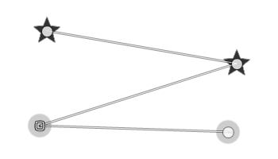
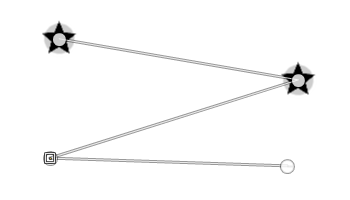

ofn-layer-aligner
=================

This script realigns an image over another by scaling and rotating it so that two designated points 
in the image comes to an exact overlap with two designated points in the reference image.

The script uses the default interpolation method.

To use:

- have the two images loaded as layers in the same Gimp image
- (recommended) make the top image partially transparent
- using the Path tool, create a path with 4 points:
  - the first two points over the reference image (the one that won't move)
  - the next two points over the adjusted image
- this path can be either a single stroke with 4 points, or two strokes of two points each
- make sure the layer with the adjusted image is selected
- call the script: *Layer>Realign layer*
- restore the full opacity of the top layer

Example
-------

- The stars are on the reference layer
- The circles are on the adjusted layer

Before calling, the path goes through the two points of the reference layer, then through the two points of the adjusted layer: 

After execution, the adjusted layer has been moved/rotated/scaled so that the points overlap:

