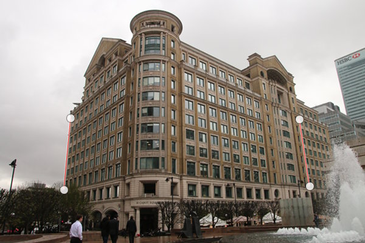

ofn-layer-straightener
======================

This script straightens up an image by rotating it so that two designated points 
in the image come to an exact vertical or horizontal. When there are no easy horizontal 
or vertical lines (due to perspective, for instance), the script can work from two pairs of points that
are assumed to be symmetrical(\*) (the horizontal or vertical is assumed to be the bissector
of the two segments). This can also be used to mark two parallel lines, in the hope that the 
small position errors will average out.

The script uses the default interpolation method.

To use:

- using the Path tool, create either:
    - a path with 2 points (on the same horizontal feature, or on the same vertical feature (side of building))
    - a path with 2 strokes of two points (typically on verticals at equal distance from each side of the picture)
- call the script: *Layer ➤ Straighten*

Note: in photography, the only trustable horizontal is the horizon itself (or, to a lesser extent, the other side of a
large body of water, if perpendicular to the camera axis). Otherwise verticals are used (architecture, etc...).

Example of use with two strokes
-------------------------------

---
(\*) but not, alas, on the Pyramids in Gizeh, since their sides fall in the ambiguous zone fo the script (too close to 45°)